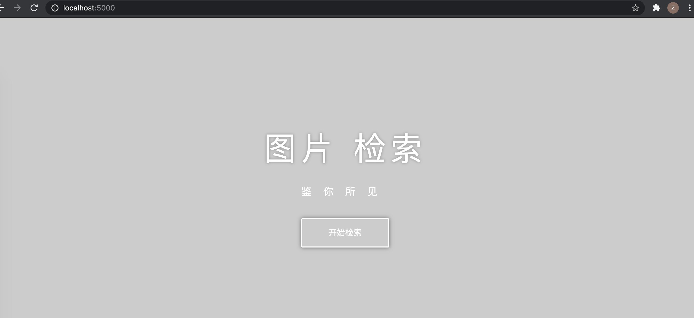
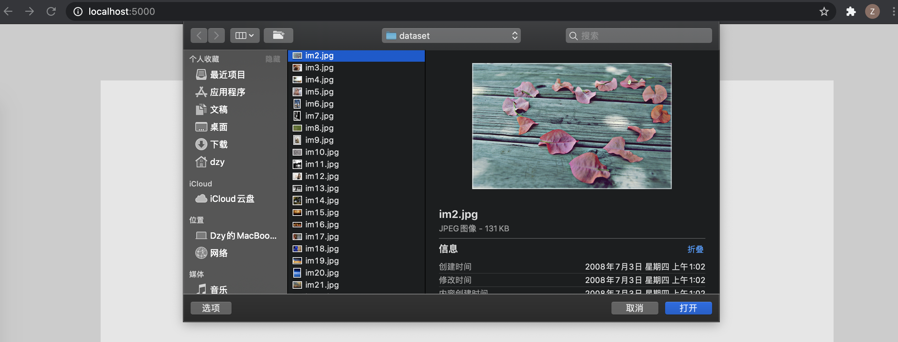
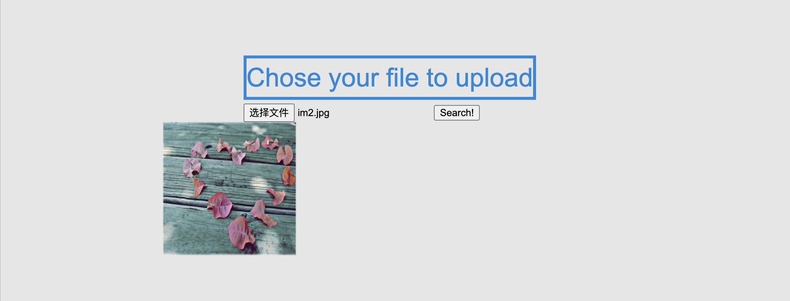
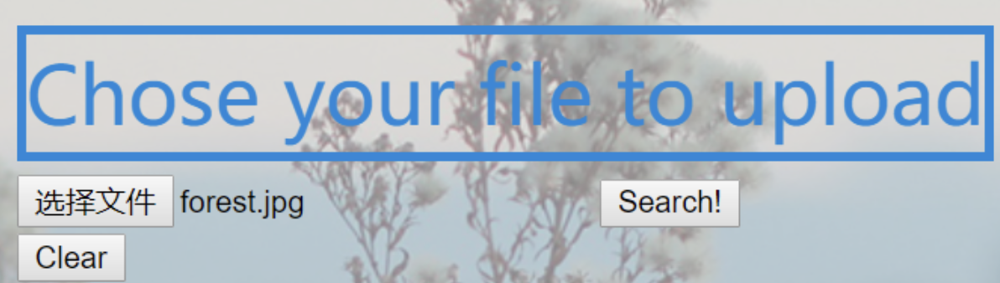
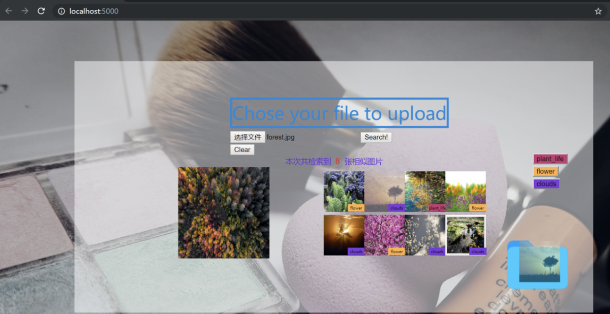
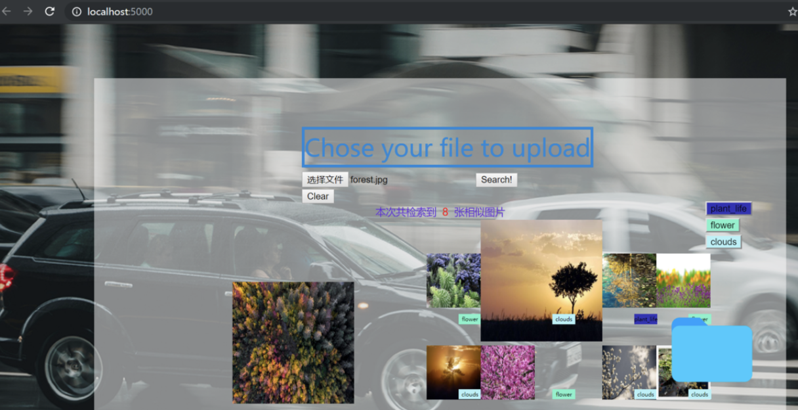
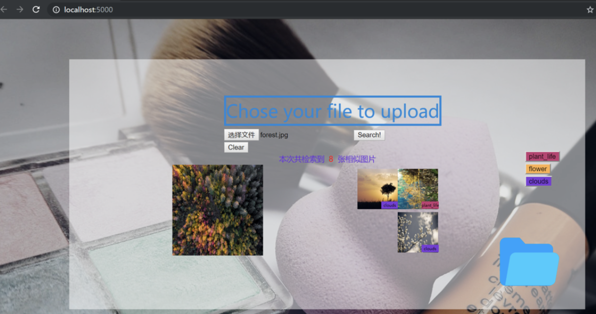
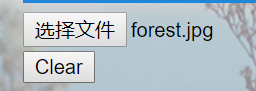
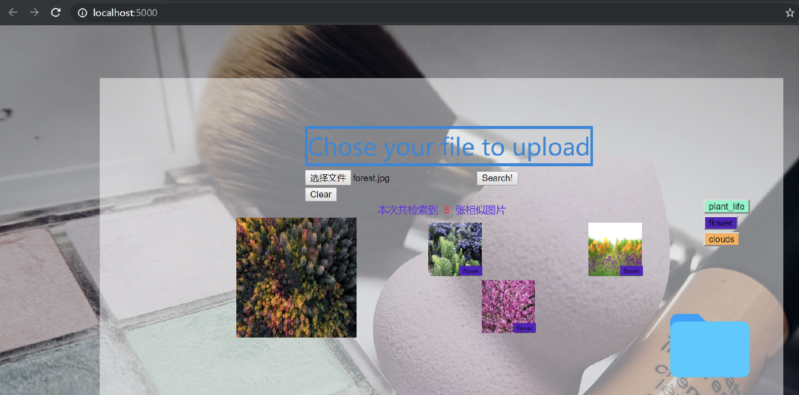

# Lab2:Infomation Retrieval

## 0. How To Run

1. Download the .zip and unzip it

2. Open the entire project by pycharm

3. Run rest-server.py

4. Once the server starts up, access <http://localhost:5000/>

5. Then use it!

   

## 1.Requirements of image search task

- A homepage which hold a brief introduction to let the user know what can this image search engine do.
- The way that this engine provide to upload your image.

- Show a waiting logo, which can relax the user when the engine is searching

- Show the source file to let the user know which image I upload to search just now.
- Show the total number of the result which can let the user know how many images are similar to my picture in your engine.
- Classify the images of the result, which can let the user browse the result  distinctly and the tags should be different(colorful).
- User can click one tag, and the system should show the images which hold this tag only.
- There should present a favorites and the user can drag the images of the result to the favorites. And if he or she click the favorites, the image search engine are supposed to show the favorite images only.
- Provide a  Clear button to search image again

## 2.A Good Product Should Be

- The page is concise and the instructions are clear
- There are many ways to upload pictures
- It's very fast to read pictures
- Display the original image uploaded by the user
- There are some hints in the loading process
- The results are clear
- The results can be saved
- You can view historical retrieval records
- Search results can be shared through multiple channels

## 3.Implement

### Show the source file

Add a function `show()` to make the file which user chose to show in the left side of the interface

1. Instantiate an `FileReader` object, which is used to read file.
2. Get the label of the image to display
3. Read the data of the File object and display it in the homologous position of the interface.

```html
<form method=post enctype=multipart/form-data"> <input type="file" name="file" required onchange="show(this)" />
```

```javascript
function show(file) {
    var reader = new FileReader(); // 实例化一个FileReader对象，用于读取文件
    var source_img = document.getElementById('source_img'); // 获取要显示图片的标签

    //读取File对象的数据
    reader.onload = function (evt) {
        source_img.width = "180";
        source_img.height = "180";
        source_img.src = evt.target.result;
    }
    reader.readAsDataURL(file.files[0]);
}
```

### Overview of the results 

Add 3 labels to complete the task, and the initialization value is `display: none;`, only if the user choose a image and click Search!, then the 3 labels will show to the user.

 The codes are as fellows:

```html
<!--搜索结果 => 本次共检索到8张图片-->
<center>
    <td>
       <b id="retrieval-result1" style="color: rgb(103, 32, 218);font-size: 15px;display: none;">
         本次共检索到 
       </b>
       <b id="retrieval-result2" style="color: rgb(255, 0, 0); font-size: 15px;display: none;">
        &nbsp;8&nbsp; </b>
       <b id="retrieval-result3" style="color: rgb(103, 32, 218);font-size: 15px;display: none;">
        张相似图片 </b>
     </td>
</center>
```

### Tags & Classify

#### Obtain tags

- All the result of the similar images will be stored in the `server\static\result` folder

- All the tags information are stored in the `server\database\tags` folder. Each `.txt` file contains the index of the image which hold this tag.

- Traverse all the file in tags folder and check if it contain the index of  the images in result folder, store the information in a dictionary, which the storage structure is like "Key - Value" <=> "index - tag"

  ```python
  # region tagfinder
  dict = {}
  
  dict.clear()
  # region 将result文件夹中的图片名字保存到result_list中
  resultPath = 'static/result'
  result_list = os.listdir(resultPath)
  for i in range(0, len(result_list)):
      result_list[i] = result_list[i][2:]  # 去除搜索结果图片名中的im
  
      (filename, extension) = os.path.splitext(result_list[i])  # 划分文件名和后缀名
      result_list[i] = filename
      print(result_list)
  # endregion
  
      tagPath = 'database/tags'
      tag_list = os.listdir(tagPath)
  
      for tagnow in tag_list:
         if result_list.__len__() == 0:  # 8张图片都已找到tag
            break
  
         with open("database/tags/" + tagnow, "r") as fp:
              str_list = fp.readlines()  # 读取文件的全部信息存储到str_list中
  
              for i in range(0, len(str_list)):
                   str_list[i] = str_list[i].rstrip()  # 去除行尾的\n
  
                   for result in result_list[::-1]:  # 倒序遍历避免删除错误
                       if str_list.count(result):  # 如果打开的此文件中有此图片标号
                          dict.setdefault(result, tagnow)  # 将图片[名-tag]加入字典中
                          result_list.remove(result)
  
  # region 去除字典中的后缀
  for key in dict.keys():
      (filename, extension) = os.path.splitext(dict[key])
      dict[key] = filename
  # endregion
  
  print(dict)
  # endregion
  ```

#### Transfer

- Then, change the `dictioinary` to a `list`, which can be sent to HTML by `jsonify`

  ```python
  images = {
     'image0': [image_list[0],dict[copy_list[0]]],
     'image1': [image_list[1],dict[copy_list[1]]],
     'image2': [image_list[2],dict[copy_list[2]]],
     'image3': [image_list[3],dict[copy_list[3]]],
     'image4': [image_list[4],dict[copy_list[4]]],
     'image5': [image_list[5],dict[copy_list[5]]],
     'image6': [image_list[6],dict[copy_list[6]]],
     'image7': [image_list[7],dict[copy_list[7]]],
     'tags': taglist,
  }
  return jsonify(images)    
  ```

#### Usage of tags

- Build some label to show the tags

  ```html
  <div class="imgtag" id="imgtag0"></div>
  ...
  <div class="imgtag" id="imgtag7"></div>
  
  
  <!--标签按钮-->
  <div class="tagbtn" style="margin-left: 10%;z-index: 9999;position: fixed !important;right: 12%;top: 40%;">
        <table id="tagtable" class="table" style="display:none;bottom: 30%;">
               <tbody>
               </tbody>
        </table>
  </div>
  ```

- The style of the imgtag & tagbtn

  ```css
  .imgtag {
      background-color: rgba(7, 214, 221, 0.7);
      position: absolute;
      top: 75%;
      left: 59%;
      width: 34px;
      height: 15px;
      text-align: center;
      line-height: 15px;
      font-size: 5px;
  }
  
  .tagbtn {
      margin-left: 10%;
      z-index: 9999;
      position: fixed !important;
      right: 12%;
      top: 40%;
  }
  ```

- Create function `addrow()` to dynamic enhancement the total number of the tags

  ```javascript
  function addrow(name, color) {
      console.log("name is " + name)
      var c = document.getElementById('tagtable'); //获得表格的信息
      if (c.rows.length == 0) { //如果是向一个空表增加一行
          var x = c.insertRow(0); //向空表插入一行
          var y = x.insertCell(0); //向新行插入一列
          y.innerHTML += "<button id=\"" + name +
              "\" style=\"background-color:" + color + ";\" onclick=\"tagClick(this)\">" + name + "</button>"
      } else {
          var z = c.rows[0].cells; //如果不是空表，首先获得表格有多少列，先获取再插入新行
          var x = c.insertRow(0);
          for (var i = 0; i < z.length; i++) { //依次向新行插入表格列数的单元格
              var y = x.insertCell(i);
              y.innerHTML += "<button id=\"" + name +
                  "\" style=\"background-color:" + color + ";\" onclick=\"tagClick(this)\">" + name + "</button>"
          }
      }
  }
  ```

- Bind a click event for tagbtn which allow the user to see the images which hold the tag only

  ```javascript
  function tagClick(e) {
      //隐藏对应的图片
      //隐藏对应的图片标签
      for (var i = 0; i < 8; ++i) {
          if (document.getElementById("img" + String(i)).name != e.id) {
              document.getElementById("img" + String(i)).style.visibility = "hidden";
              document.getElementById("imgtag" + String(i)).style.visibility = "hidden";
          }
      }
  
      //显示对应的图片
      //显示对应的图片标签
      for (var i = 0; i < 8; ++i) {
          if (document.getElementById("img" + String(i)).name == e.id) {
              document.getElementById("img" + String(i)).style.visibility = "visible"
              document.getElementById("imgtag" + String(i)).style.visibility = "visible";
          }
      }
  }
  ```

  

- Generate random color for different imgtag & tagbtn which can classify the result clearly and easily

  ```javascript
  function randomHexColor() { //随机生成十六进制颜色
      var hex = Math.floor(Math.random() * 16777216).toString(16); //生成ffffff以内16进制数
      while (hex.length < 6) { //while循环判断hex位数，少于6位前面加0凑够6位
          hex = '0' + hex;
      }
      return '#' + hex; //返回‘#'开头16进制颜色
  }
  
  for (var i = 0; i < tags.length; ++i) {
       var color = randomHexColor()
       color_list.push(color)
       addrow(tags[i], color)
  }
  
  document.getElementById("imgtag0").style.backgroundColor = String(
                      color_list[tags.indexOf(response.image0[1])])
  ...
  document.getElementById("imgtag7").style.backgroundColor = String(
                      color_list[tags.indexOf(response.image7[1])])
  ```

<a name="Favorites"></a>  

### Favorites

#### Found favorites

- Place the favorites in the top level, which the favorites can roll with the screen

  ```html
  <!--收藏夹-->
  <div style="margin-left: 70%;z-index: 9999; position: fixed ! important;right: 12%;top: 67%;">
       
  </div>
  ```

#### Drag the images to the favorites

- The user can drag the images to the favorites which mean you want to save it specially.

- If you click the favorites, you can see the favorite images which you save only.

  ```javascript
  const OPEN = 1;
  const CLOSED = 2;
  const STAR_OPEN = 3;
  const STAR_CLOSED = 4;
  
  var favorites_img = [];
  var favorites_flag = CLOSED;
  
  document.addEventListener("dragstart", function (event) {
      console.log("start...")
      //dataTransfer.setData()方法设置数据类型和拖动的数据 
      console.log(event.target.id)
      event.dataTransfer.setData("Text", event.target.id);
      //修改拖动元素的透明度 
      event.target.style.opacity = "0.4";
  });
  // 当拖完p元素输出一些文本元素和重置透明度 
  document.addEventListener("dragend", function (event) {
      event.target.style.opacity = "1";
  });
  // 当p元素完成拖动进入droptarget,改变div的边框样式 
  document.addEventListener("dragenter", function (event) {
      if (event.target.className == "favorites") {
          console.log("ok...")
      }
  });
  
  /*对于drop,防止浏览器的默认处理数据(在drop中链接是默认打开) 
  复位输出文本的颜色和DIV的边框颜色 
  利用dataTransfer.getData()方法获得拖放数据 
  拖拖的数据元素id("drag1") 
  拖拽元素附加到drop元素*/
  document.addEventListener("drop", function (event) {
      event.preventDefault();
      if (event.target.className == "favorites") {
          if (favorites_flag == OPEN) {
              favorites_flag = STAR_OPEN;
          } else if (favorites_flag == CLOSED) {
              favorites_flag = STAR_CLOSED;
          }
          //更换收藏夹图标
          event.target.src =
              "https://upload-images.jianshu.io/upload_images/12014150-383ad52c8d75dfbb.png?imageMogr2/auto-orient/strip%7CimageView2/2/w/1240"
  
          var data = event.dataTransfer.getData("Text");
          favorites_img.push(data)
      }
  });
  
  // 默认情况下,数据/元素不能在其他元素中被拖放。对于drop我们必须防止元素的默认处理 
  document.addEventListener("dragover", function (event) {
      event.preventDefault();
  });
  
  function favoritesClick() {
      favoriateData = document.getElementById("favorites");
      if (favorites_flag == OPEN) {
          favorites_flag = CLOSED;
          favoriateData.src =
              "https://upload-images.jianshu.io/upload_images/12014150-dd7e1b70111fdaa9.png?imageMogr2/auto-orient/strip%7CimageView2/2/w/1240";
      } else if (favorites_flag == CLOSED) {
          favorites_flag = OPEN;
          favoriateData.src =
              "https://upload-images.jianshu.io/upload_images/12014150-1b0432d7f3f099a8.png?imageMogr2/auto-orient/strip%7CimageView2/2/w/1240";
      } else if (favorites_flag == STAR_CLOSED) {
          favorites_flag = STAR_OPEN;
          favoriateData.src =
              "https://upload-images.jianshu.io/upload_images/12014150-1b0432d7f3f099a8.png?imageMogr2/auto-orient/strip%7CimageView2/2/w/1240"
          for (var i = 0; i < 8; ++i) {
              if (favorites_img.indexOf("img" + String(i)) == -1) {
                  document.getElementById("img" + String(i)).style.visibility = "hidden";
                  document.getElementById("imgtag" + String(i)).style.visibility = "hidden";
              } else {
                  document.getElementById("img" + String(i)).style.visibility = "visible";
              }
          }
      } else if (favorites_flag == STAR_OPEN) {
          favorites_flag = STAR_CLOSED;
          favoriateData.src =
              "https://upload-images.jianshu.io/upload_images/12014150-383ad52c8d75dfbb.png?imageMogr2/auto-orient/strip%7CimageView2/2/w/1240";
          for (var i = 0; i < 8; ++i) {
              document.getElementById("img" + String(i)).style.visibility = "visible";
              document.getElementById("imgtag" + String(i)).style.visibility = "visible";
          }
      }
  }
  ```

### Enlarge & shrink of the images

- Click the image of the result, then the image while enlarge.

- Another click will shrink the image

- First, I define two style of the images

  ```css
  .max {
      transition: 0.3s;
      width: 180px;
      height: 180px;
  }
  
  .min {
      transition: 0.3s;
      width: 80px;
      height: 80px;
  }
  ```

- Then, bind a event for all the images which toggle the image to change from two style

  ```javascript
  $(function () {
      for (var i = 0; i <= 8; i++) {
          $('#img' + String(i)).click(function () {
              $(this).toggleClass('min');
              $(this).toggleClass('max');
          });
      }
  });
  ```


## 4.Five Stage Search Framework

### Formulation

- Homepage

  

- The user can only upload his or her picture fromlocal

  

- Permit variants to allow relaxation of search constraints 

- Show the source file

  

### Initiation of action

- Button

  

- Drag the image to the favorites

  

  

### Review of results

- Keep search terms and constrains visible

- Overview of results

  

- Enlarge & Shrink

  

- Display the favorite images only

  


### Refinement

- Make changing of search parameters convenient, click `Clear` button and will back to the homepage which allow the user to choose another image.

  

### Use

- Save the result in the favorites and can see the favorite images only.

  
